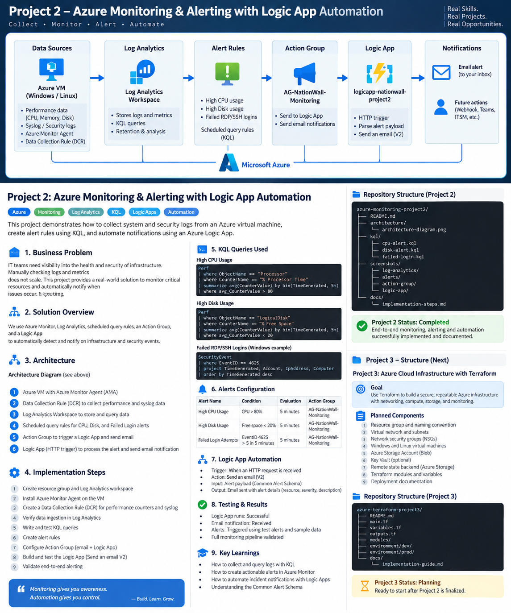

# NationWall – Azure Monitoring & Alerting with Logic App Automation

## Project 2

This project demonstrates an Azure monitoring workflow for a Linux virtual machine: telemetry is collected into Log Analytics, queried with KQL, evaluated by Azure Monitor alert rules, routed through an Action Group, and processed by an Azure Logic App.

> Collect • Monitor • Alert • Automate

## 1. Business Problem

Infrastructure teams need visibility into system health and security events without relying on manual log checking.

This project addresses:
- High CPU utilization
- High disk utilization
- Failed Linux authentication attempts

The solution centralizes monitoring data in Log Analytics, applies KQL-based detection rules, and automates alert handling.

## 2. Architecture



```text
Azure Linux VM
      |
      | Azure Monitor Agent + Data Collection Rule
      v
Log Analytics Workspace
      |
      | KQL
      v
Azure Monitor Alert Rules
      |
      v
AG-NationWall-Monitoring
      |
      +--------------------+
      |                    |
      v                    v
Direct Email         Logic App
                           |
                           v
                    Send an email (V2)
```

## 3. Components

| Component | Purpose |
|---|---|
| `vm-nationwall-private` | Linux workload being monitored |
| Azure Monitor Agent | Collects telemetry |
| Data Collection Rule | Defines performance and Syslog collection |
| `law-nationwall-project2` | Stores and queries monitoring data |
| `NationWall-High-CPU` | Detects average CPU above 80% |
| `NationWall-High-Disk` | Detects average disk usage above 80% |
| `NationWall-Failed-Login` | Detects failed authentication events |
| `AG-NationWall-Monitoring` | Central alert routing |
| `logicapp-nationwall-project2` | Receives alert payloads and sends email |
| Office 365 Outlook – Send an email (V2) | Sends the Logic App notification |

## 4. KQL Queries

### CPU
```kusto
Perf
| where TimeGenerated > ago(5m)
| where ObjectName == "Processor"
| where CounterName == "% Processor Time"
| summarize AvgCPU = avg(CounterValue)
```

### Disk
```kusto
Perf
| where TimeGenerated > ago(5m)
| where ObjectName == "Logical Disk"
| where CounterName == "% Used Space"
| summarize AvgDiskUsed = avg(CounterValue)
```

### Failed Login
```kusto
Syslog
| where Facility == "authpriv"
| where SyslogMessage has "Failed password"
| summarize FailedLogins = count()
```

### Event Verification
```kusto
Syslog
| where Facility == "authpriv"
| where SyslogMessage has "Failed password"
| project TimeGenerated, Computer, ProcessName, SeverityLevel, SyslogMessage
| order by TimeGenerated desc
```

## 5. Alert Configuration

| Alert | Condition | Frequency |
|---|---|---|
| `NationWall-High-CPU` | `AvgCPU > 80` | 5 minutes |
| `NationWall-High-Disk` | `AvgDiskUsed > 80` | 5 minutes |
| `NationWall-Failed-Login` | `FailedLogins > 0` | 5 minutes |

The three alert rules were observed as enabled with Severity 2 – Warning.

## 6. Action Group

`AG-NationWall-Monitoring`

Configured:
- Verified email notification
- Logic App action: `LogicApp-NationWall`
- Logic App: `logicapp-nationwall-project2`
- Common Alert Schema enabled for the Logic App action

## 7. Logic App Automation

```text
When an HTTP request is received
                |
                v
        Send an email (V2)
```

Useful Azure Monitor alert fields include:
- `alertRule`
- `severity`
- `monitorCondition`
- `firedDateTime`
- `alertTargetIDs`

## 8. Testing and Results

The Logic App Run history showed successful executions for the HTTP trigger and the `Send an email (V2)` action.

A controlled failed authentication event was successfully found in Syslog through KQL.

### Validation note

During the captured testing session, the Azure Action Group sample test returned a failed/unknown result even though the Logic App Run history showed successful executions. The sample test is therefore documented as a troubleshooting note rather than presented as successful end-to-end validation.

## 9. Security and Operational Decisions

- Collect only the telemetry required for the monitoring scenarios.
- Reuse one Action Group across the three alerts.
- Use Common Alert Schema for the Logic App integration.
- Use a controlled authentication-failure event to validate detection.
- Keep evidence separate from credentials and sensitive configuration.
- Do not commit passwords, tokens, secrets, or local Terraform state.

## 10. Implementation Summary

1. Created the Log Analytics workspace.
2. Connected the Linux VM with Azure Monitor Agent.
3. Configured Data Collection Rules.
4. Collected performance and Syslog data.
5. Verified telemetry in Log Analytics.
6. Built and tested KQL queries.
7. Created CPU, disk, and failed-login alert rules.
8. Created the reusable Action Group.
9. Created the Logic App.
10. Added the HTTP trigger and Office 365 Outlook email action.
11. Connected the Logic App to the Action Group.
12. Verified successful Logic App workflow runs.
13. Captured evidence and prepared documentation.

## 11. Repository Structure

```text
azure-monitoring-project2/
├── README.md
├── docs/
│   ├── implementation-guide.md
│   └── assets/
│       └── architecture.png
├── kql/
│   ├── cpu-alert.kql
│   ├── disk-alert.kql
│   └── failed-login.kql
└── screenshots/
    ├── log-analytics/
    ├── alerts/
    ├── action-group/
    └── logic-app/
```

## 12. Key Learning Outcomes

- Azure Monitor
- Log Analytics
- KQL
- Azure Monitor Agent
- Data Collection Rules
- Log-search alerts
- Action Groups
- Azure Logic Apps
- HTTP-triggered automation
- Office 365 Outlook integration
- Common Alert Schema
- Monitoring and security-event troubleshooting

## 13. Project Status

**Build completed.**

Monitoring, alerting, Action Group configuration, and the Logic App workflow were implemented. The Logic App has successful recorded workflow runs. The captured Action Group sample test produced an inconsistent failed/unknown result and is documented transparently as a validation note.

## 14. Next Project

### Project 3 – Azure Cloud Infrastructure with Terraform

Planned focus:
- Terraform-based Azure infrastructure
- Reusable variables and modules
- VNet and subnets
- Network security groups
- Virtual machines
- Azure Storage
- Remote Terraform state
- Environment structure
- Deployment documentation
- Validation and repeatable deployments
